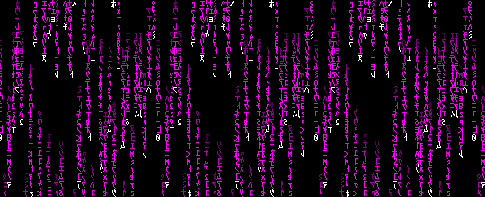

<!-- ====================================================== -->
<!--                  MERAKI CODES PROFILE                  -->
<!-- ====================================================== -->

<div align="center">


# Meraki Codes

**Computer Science Student · Data · AI · Cloud · Cybersecurity**

<br>



<br><br>


<br><br>

<sub>♡ building · learning · experimenting ♡</sub>

</div>


<p align="center">
────────────୨ৎ────────────
</p>


## `whoami`

I'm **Ashlee**, a Computer Science student who enjoys learning by building.

I'm interested in **data analytics, artificial intelligence, cloud computing, data engineering, cybersecurity, and software development**.

I use this GitHub to document the projects and technical experiments I build as I continue developing my skills.


<p align="center">
────────────୨ৎ────────────
</p>


## `tech stack`

<div align="center">

### Languages


<br><br>

### Data + Databases


<br><br>


<br><br>

### Tools + Platforms


<br><br>


</div>


<p align="center">
────────────୨ৎ────────────
</p>


## `featured project`

<div align="center">

### Pfizer Document Intelligence Chatbot

**OCR · Semantic Search · RAG · PDF Question Answering**

<br>

An AI-powered document intelligence chatbot that extracts information from PDF documents, retrieves relevant content, and answers questions based on the uploaded material.

<br><br>

**Built with**


<br><br>

<a href="https://github.com/merakicodes/pfizer-document-intelligence-chatbot">
  
</a>

</div>


<p align="center">
────────────୨ৎ────────────
</p>


## `github activity`

<div align="center">


<br><br>


</div>


<p align="center">
────────────୨ৎ────────────
</p>


## `currently`

```text
🌱 learning      → cloud + data engineering
📊 building      → data projects
🤖 exploring     → artificial intelligence
🛡️ practicing    → cybersecurity
📱 creating      → personal apps
```

<p align="center">
────────────୨ৎ────────────
</p>


<div align="center">

### `let's build something ♡`


<br><br>

`code with curiosity · build with intention`

<br><br>


</div>
